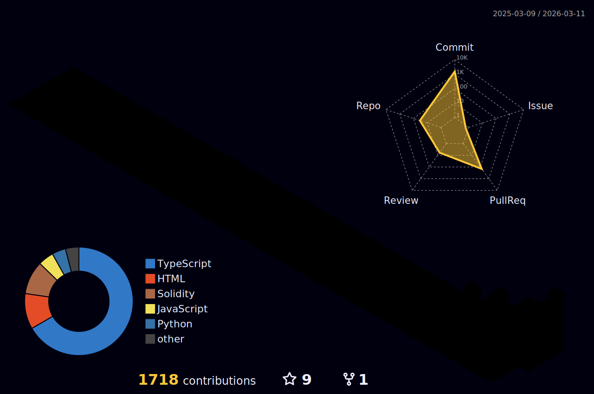

## Hi, I'm Jerry Chen | Software Developer 🇹🇼

<p align="left">

</p>

<p align="left">
<a href="https://github.com/JhiNResH"></a>
<a href="https://medium.com/@dontforgetbananatiff/"></a>
<a href="mailto:jhinresh@gmail.com"></a>
<a href="https://twitter.com/JhiNResH"></a>
</p>

---

### ⚡ About Me


- 🎯 **Focus Areas:** DeFi / Stablecoin / AMM / RWA / ZK
- 🛠️ **Current Work:** Developing hackathon projects and Web3 dApps.
- 🌱 **Growth:** Deep diving into the **SVM / EVM Ecosystem** & **Rust**.
- 👯 **Collaboration:** Open to collaborating on any blockchain-related projects.
- 🤔 **Goal:** Actively seeking **Web3 Developer Jobs**.
- 💡 **Fun Fact:** I hold a Bachelor's degree in Mechanical Engineering.
- 📫 **Reach Me:** [jhinresh@gmail.com](mailto:jhinresh@gmail.com)

---

### 🛠 Languages & Tools

| Category       | Skills & Frameworks                                                                                                                                                                                                                                                                                                                                                                                                         |
| :------------- | :-------------------------------------------------------------------------------------------------------------------------------------------------------------------------------------------------------------------------------------------------------------------------------------------------------------------------------------------------------------------------------------------------------------------------- |
| **Languages**  |     |
| **Blockchain** |                                         |
| **Web Tech**   |                     |

---

### 🌌 GitHub 3D Metrics

<p align="center">
  
</p>

---

### ⏱️ Weekly Coding Stats

<!--START_SECTION:waka-->


**🐱 My GitHub Data** 

> 📦 ? Used in GitHub's Storage 
 > 
> 🏆 304 Contributions in the Year 2026
 > 
> 💼 Opted to Hire
 > 
> 📜 79 Public Repositories 
 > 
> 🔑 0 Private Repositories 
 > 
**I'm a Night 🦉** 

```text
🌞 Morning                187 commits         ██░░░░░░░░░░░░░░░░░░░░░░░   09.69 % 
🌆 Daytime                674 commits         █████████░░░░░░░░░░░░░░░░   34.94 % 
🌃 Evening                1035 commits        █████████████░░░░░░░░░░░░   53.65 % 
🌙 Night                  33 commits          ░░░░░░░░░░░░░░░░░░░░░░░░░   01.71 % 
```


📊 **This Week I Spent My Time On** 

```text
🐱‍💻 Projects: 
team-kindred             27 hrs 51 mins      ██████████░░░░░░░░░░░░░░░   40.60 % 
kindred                  14 hrs 31 mins      █████░░░░░░░░░░░░░░░░░░░░   21.17 % 
maat                     6 hrs 17 mins       ██░░░░░░░░░░░░░░░░░░░░░░░   09.17 % 
Dev601                   5 hrs 9 mins        ██░░░░░░░░░░░░░░░░░░░░░░░   07.51 % 
openclaw                 4 hrs 11 mins       ██░░░░░░░░░░░░░░░░░░░░░░░   06.11 % 
```


 Last Updated on 08/02/2026 02:53:11 UTC
<!--END_SECTION:waka-->

<p align="center">
  
</p>

---

⭐️ Built by [JhiNResH](https://github.com/JhiNResH)
